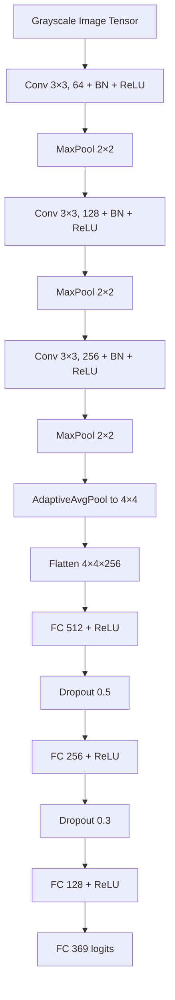

# HASYv2 Handwritten Symbol Classification (PyTorch)

## Project Summary
This repository documents a PyTorch pipeline for classifying 369 handwritten symbols from the HASYv2 dataset. The primary implementation lives in the notebook, while Methodology.pdf captures the broader experimental design. The README consolidates both sources with a clear description of data preparation, augmentation, architectures evaluated, and training methodology.

## Project Artifacts
- **Notebook:** `hasyv2-handwritten-symbols-dataset-pytorch (3).ipynb`
- **Methodology write-up:** `Methodology.pdf`
- **Kaggle notebook:** https://www.kaggle.com/code/shaikabdussattar/hasyv2-handwritten-symbols-dataset-pytorch

## Dataset
HASYv2 Handwritten Symbol Dataset (369 classes):
https://data.niaid.nih.gov/resources?id=zenodo_259444

Notebook inputs:
- `metaData.csv` (metadata about symbols)
- `train.csv` (labeled training set)
- `test.csv` (unlabeled test set)

## Data Preparation
### Notebook implementation
1. **CSV inspection & cleaning**
   - Load `metaData.csv`, `train.csv`, and `test.csv` using Pandas.
   - Inspect metadata for missing values with `metaData.isna().sum()`.
   - Compute per-class counts with `train['label'].value_counts()` to drive augmentation.

2. **Label normalization**
   - Map the original non-contiguous label IDs to a contiguous range `[0, 368]` for training.
   - Create a reverse map to translate predictions back to original IDs for submission.

3. **Image preprocessing**
   - Dataset images are already grayscale and normalized per the dataset description.
   - Notebook applies `transforms.Grayscale(num_output_channels=1)` and `transforms.ToTensor()`.
   - Training tensors are optionally loaded from preprocessed `.pt` files to speed up execution on Kaggle.

### Methodology.pdf design notes
- Validate data types, handle missing values, and remove duplicates.
- Resize to a fixed input size when using transfer learning backbones (e.g., 224×224 for ViT/ResNet).
- Normalize pixel values (mean 0.5, std 0.5) when required by chosen models.

## Data Augmentation
### Notebook augmentation strategy
Augmentation is applied **only** to classes with fewer than 100 samples, generating enough new examples to reach ~200 per class:
- `RandomRotation(10)`
- `RandomAffine(0, shear=10, scale=(0.8, 1.2))`
- `RandomHorizontalFlip()`
- `Grayscale` + `ToTensor`

### Methodology.pdf augmentation options
- Rotation & flipping for orientation invariance
- Brightness/contrast adjustments to reduce lighting sensitivity
- Random cropping & scaling to simulate different viewpoints

## Model Architectures
### CNNs implemented in the notebook
| Model | Convolutional Backbone | Pooling | Fully Connected Head | Dropout |
| --- | --- | --- | --- | --- |
| **Baseline CNN** (commented) | 1→32→64→128 (3×3) | MaxPool after each conv | 4×4×128 → 128 → 369 | None |
| **BN + Adaptive Pool CNN** (commented) | 1→32→64→128 + BatchNorm | MaxPool + AdaptiveAvgPool(4×4) | 4×4×128 → 256 → 128 → 369 | 0.4, 0.3 |
| **Final CNN (selected)** | 1→64→128→256 + BatchNorm | MaxPool + AdaptiveAvgPool(4×4) | 4×4×256 → 512 → 256 → 128 → 369 | 0.5, 0.3 |

### Final CNN architecture diagram

### Additional architectures referenced in Methodology.pdf
- Transfer learning backbones such as **ResNet** and **EfficientNet** (Torchvision).
- Transformer-based approaches, including **Vision Transformer (ViT)**, for image classification.

## Training & Optimization
### Notebook training setup
- **Loss:** CrossEntropyLoss
- **Optimizer (final runs):** SGD with momentum 0.9 and weight decay 1e-4
- **Learning rates tried:** 0.02, 0.005, 0.001
- **Schedulers:**
  - StepLR (`step_size=10`, `gamma=0.7`)
  - ReduceLROnPlateau (`patience=5` or `3`, `factor=0.7` or `0.5`)
- **Batch size:** 64
- Training loop tracks loss and accuracy for each epoch.

### Methodology.pdf training experiments
- Optimizers compared: **SGD**, **Adam**, **RMSprop**
- Learning rate sweeps from **1e-1 to 1e-6**
- Scheduler experiments with **StepLR** and **ReduceLROnPlateau**

## Evaluation & Inference
- Notebook computes predictions on `test.csv` and reverse-maps labels back to original IDs.
- Outputs are stored in `submission.csv` for downstream evaluation.
- Methodology.pdf recommends monitoring accuracy/loss curves and using confusion matrices, precision, recall, and F1-score for deeper analysis.

## Contributors
- Shaik Abdus Sattar (Seventie)
- A C Sanhitha Reddy ([@sanhithaac](https://github.com/sanhithaac))
